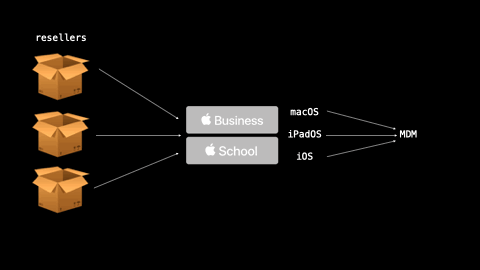

# Making SimpleMDM Complicated 

Presented at [MacDevOps YVR 2021](https://mdoyvr.com/)

## Content

### Presentation

- 🔜 Video Link
- [Slides](./Making_SimpleMDM_Complicated.pdf)
- [Slide text as markdown](./Making_SimpleMDM_Complicated.md)

### Examples

- [SimpleMDM JSON Payloads](./examples/json_payloads/)
- [Python Scripts using SimpleMDMpy](./examples/json_payloads/)

## Resources

[SimpleMDM](https://simplemdm.com/)
[SimpleMDMpy](https://github.com/macadmins/simpleMDMpy)
[A ramble on event driven client management](https://lucasjhall.github.io/2021/05/18/event-driven-client-management.html)
